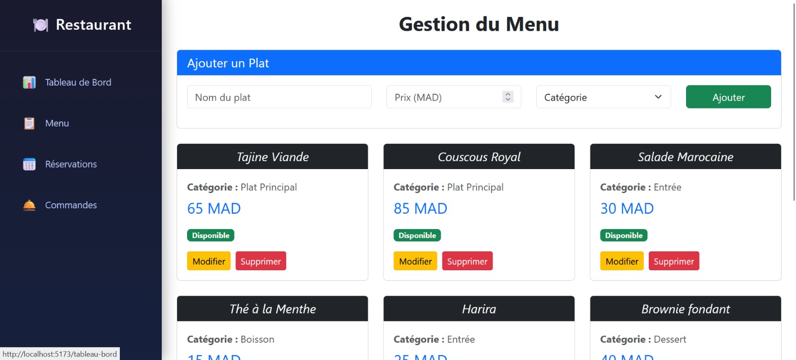
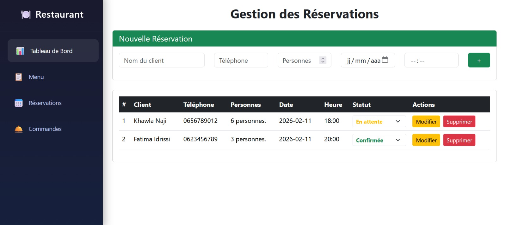
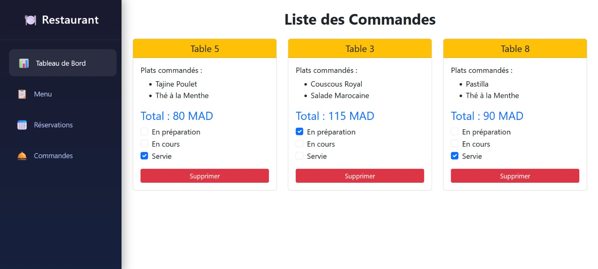
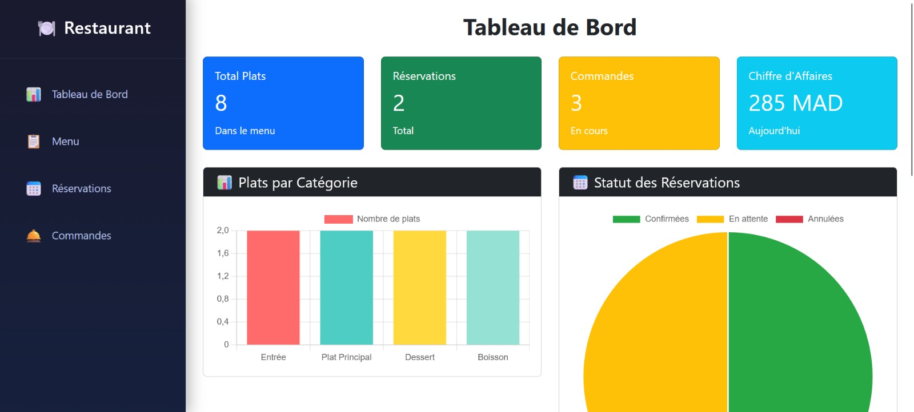

# Restaurant Management

A React project for managing a restaurant menu. Built with **React.js**, **Bootstrap**, **Axios**, and a fake REST API (`json-server`).

## Features

- Manage restaurant menu: add, edit, delete dishes
- Manage reservations: add, edit, cancel, track status
- Manage orders: view, update status, delete
- Dashboard with stats and charts
- Responsive design with Bootstrap
- Real-time data updates with Axios

## Tech Stack

- *Frontend:* React.js, Bootstrap  
- *HTTP Client:* Axios  
- *Backend (Fake):* JSON Server (db.json)

## Setup

```bash
git clone https://github.com/hilali-marwa017/restaurant-management.git
cd restaurant-management
npm install
npx json-server --watch db.json --port 3001
npm run dev 
```
## Screenshots

### Menu


### Reservation


### Command


### Dashboard


## Author

**Marwa Hilali**  
- GitHub: [hilali-marwa017](https://github.com/hilali-marwa017)  
- LinkedIn: [Marwa Hilali](https://www.linkedin.com/in/marwa-hilali)
